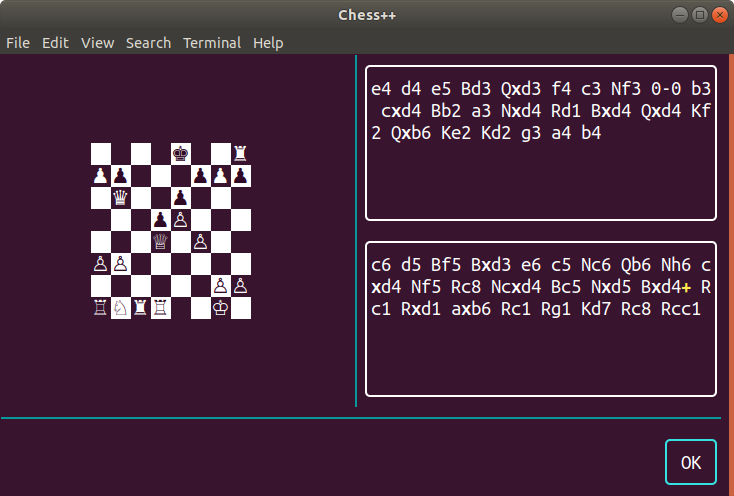

A program that shows a mock-up of how a chess program using Munin might look



To build: you will need to have installed Console++, Terminal++ and Munin as dependencies.

You can then build with:

```
cmake .
make -j
```

    ./chess

will display a chess board with some other graphical displays, and a button that you can click with either the mouse, or by using space or enter on the keyboard to end the program.