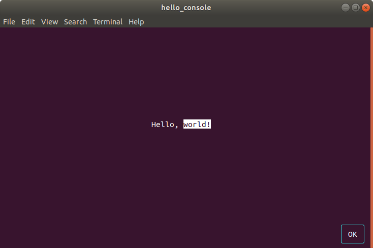

A program that shows how to tie together Console++ and Munin into a working application.



To build: you will need to have installed Console++, Terminal++ and Munin as dependencies.

You can then build with:

```
cmake .
make -j
```

    ./hello_console

will display a console with a message and a button that you can click with either the mouse, or by using space or enter on the keyboard.